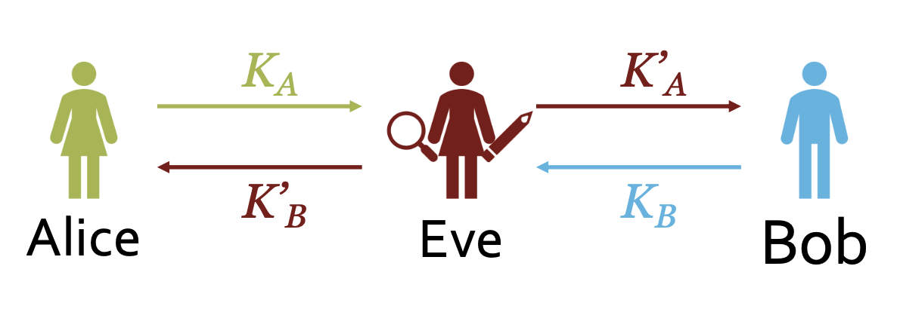
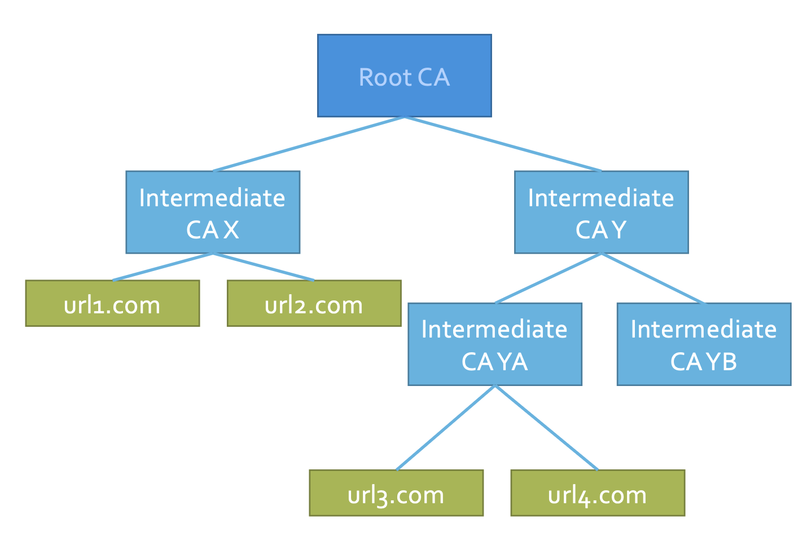

# Lecture 10

## Assumptions

- we encrypt and sign a message from Alice to Bob and decryption is successful and the signature verifies
- Bob knows that
  - Alice knows the plaintext (and anyone else she shared it with or copied it from)
  - Alice (or someone with her private key) signed the plaintext at some point in the past
- Alice knows that
  - Only Bob (or someone with his private key) can extract the plaintext from the encrypted channel
  - Bob (or anyone else) can prove that Alice (or someone with her private key) signed the plaintext

## Certificates

- One challenge is to get the public key
- A MitM attacker can impersonate each party to the other

  </img>

### Sol 1: Using A Trusted Intermediary

- Alice and Bob have already exchanged keys with Charlie
- Charlie sends signed message with Alice’s key to Bob
- Charlie sends signed message with Bob’s key to Alice
- Alice and Bob trust Charlie to send the real public keys
- Alice and Bob now have each other’s public key
- Problem: Alice has to do this with every new party

### Sol 2: Using A Certificate from A Trusted Intermediary

- Charlie creates a certificate: “I, Charlie, verified that Alice’s key is ... ”
- Charlie signs the message and sends it to Alice
- Alice can then send a new party her public key along with **Charlie's certificate**
- If a new party trusts Charlie, then they can trust the key is Alice's public key

## Trusted Intermediary (Who Is Charlie)

- PGP: Charlie is any other person you trust
- Modern (almost everywhere): Charlie is a Certificate Authority

### Certificate Authority (CA)

- Browsers usually have a list of trusted CAs
- Semantics
  - Subject (name, domain)
  - Issuing CA
  - Validity period
  - Limitations on use

## Transport Layer Security (TLS)

- This is how https works
- Basic idea:
  - Browser gets and verifies server’s certificate and extracts PK
  - Use PK to encrypt random symmetric session key
  - Use symmetric key to encrypt message and use HMAC with the key for integrity

## Certificate Hierarchy

- Root CA signs keys for Intermediate CAs, which in turn sign keys for users (or other intermediate CAs)

  </img>

## Certificate Revocation

- What if the private key is compromised?
  - CA and PGP PKIs support revocation (private key needed)
- How does Bob know Alice's key is revoked?
  - A MitM attacker can forge to say No to Bob if he asks Alice
  - Availability of **trusted revocation list** is critical
- How to revoke?
  - PGP: use private key to revoke (can't if lost)
  - CA: ask CA to revoke
- Mechanisms
  - Certificate Revocation List (CRL)
    - Certificate says where to get CRL
    - Clients periodically download updated CRLs
  - Online Certificate Status Protocol (OCSP)
    - Query CA about status of cert before trusting it

## Content Delivery Network (CDN)

- geographically distributed network of proxy servers
- pros
  - cache content closer to requesters
  - improve latency
  - decrease congestion
- cons
  - mess up our nice abstraction
  - i.e. Alice deliberately wants CDN to impersonate her to Bob

### Sol #1: "Subject Alternate Name"

- “Yeah, I’m CDN, but I’m authorized to communicate on behalf of Alice”
- CA decides whether a CDN can get a given Subject Alternate Name in its certificate

## Secure Shell (SSH)

- No trusted authorities
- Trust on first use
- Certificate pinning
