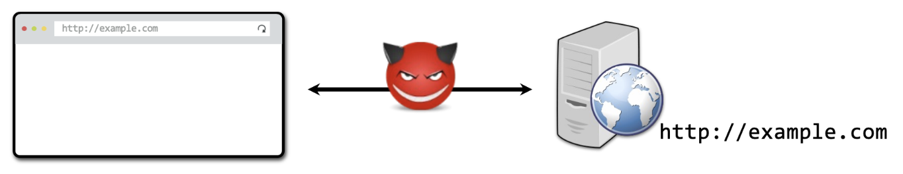
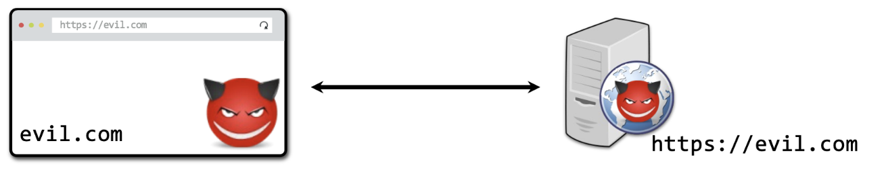
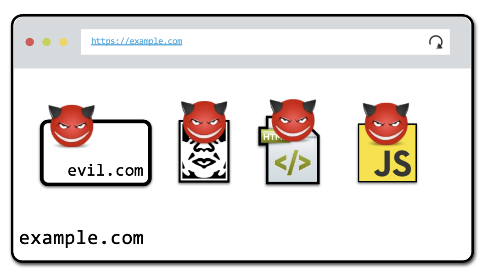
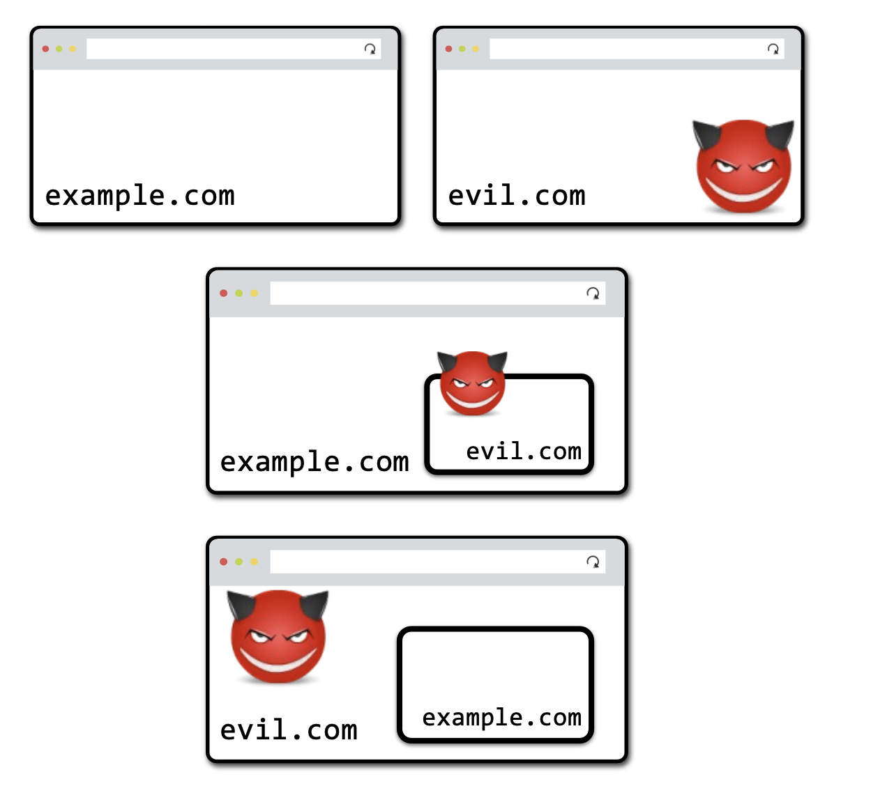
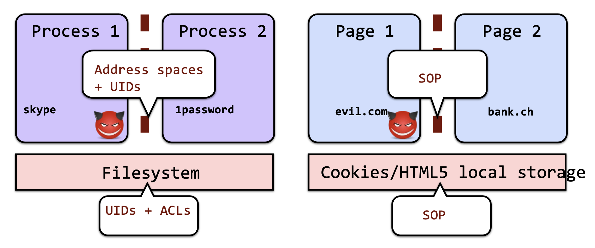
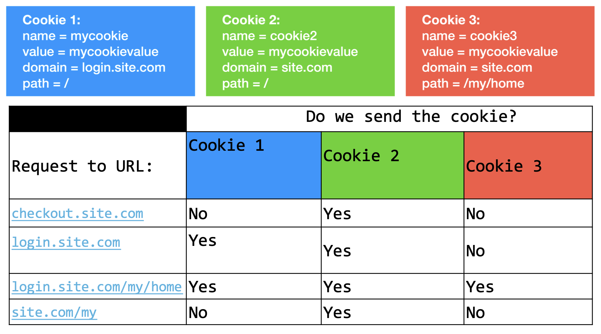
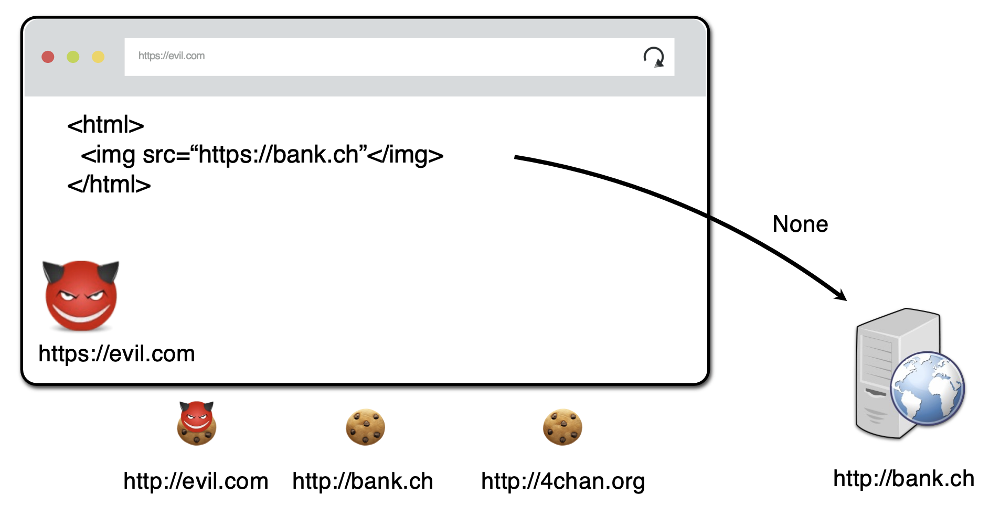
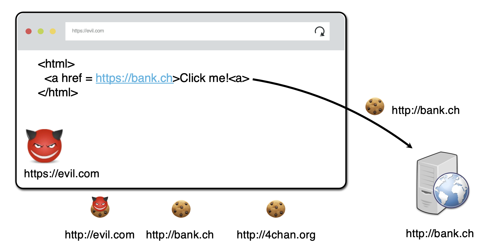

# Lecture 11

## Web Cookies

- The web server provides tokens in its response to the web browser.
  - `Set-Cookie: <cookie-name>=<cookie-value>; Property=property-value`
  - properties include when the cookie expires, only https, etc.
- Browser will then attach the cookie to all subsequent requests
- Session cookies:
  - Expiration property not set
  - Exist only during current browser session
  - Deleted when browser is shut down (unless user configure browser to restart the session)
- Persistent cookies:
  - stay until the server-defined expiration time

## Browser Execution Model

- basic: Each browser window/tab
- nested: A window may contain frames from different sources (isolations)

## Relevant Attacker Models

1. Network Attacker

   </img>

2. Web Attacker

   </img>

3. Gadgets Attacker

   </img>

### Web Attacker Variants

</img>

## Web Security Model

- Browsers are like operating systems
- Need to isolate different activities

  </img>

### Same Origin Policy (SOP)

- Origin: isolation unit / trust boundary on the web
  - Unit: (scheme, domain, port) tuple
- Goal: isolate content from different origins
  - Confidentiality: script from site B can't read content in site A
  - Integrity: script from site B can't modify content in site A
- Frame can also only access content from the same origin
- **Pages can perform requests across origins**
  - SOP does **not prevent** a page from **leaking data to another origin** by encoding it in the **URL, request body**, etc.

### Document & Script & Image

- Document
  - can load cross-origin HTML in frames
  - can't inspect or modify
- Script
  - can load scripts from different origins
  - execute with different privileges
- Image
  - can render images from different origins
  - can see other properties (`img.width`)
  - can't inspect pixels

## Web Cookie

## Cookie SOP

- Origin unit: ([scheme], domain, path)
  - domain: any domain-suffix of URL-hostname, except public ones
    - host = `login.site.com`
    - allowed: `login.site.com`, `.site.com`
    - disallowed: `other.site.com`, `othersite.com`, `.com`
  - path: a prefix of the URL path
- Examples

  </img>

### Problem #1

- Attackers can still access cookie via `document.cookie`
- Partial Solution: set property `httpOnly`

### Problem #2

- attackers can still send http requests to victim origin (via `img.src`)
- Partial Solution: SameSite
  - **Strict**: A same-site cookie is only sent when the request originates from the same site (top-level domain)
  - **Lax**: Send cookie on top-level “safe” navigations (even if navigating cross-site)
  - **None**: send cookie without taking context into account.
- Lax Examples

  </img>
  </img>

### Secure Cookie

- Only send cookies with an encrypted request over HTTPS
