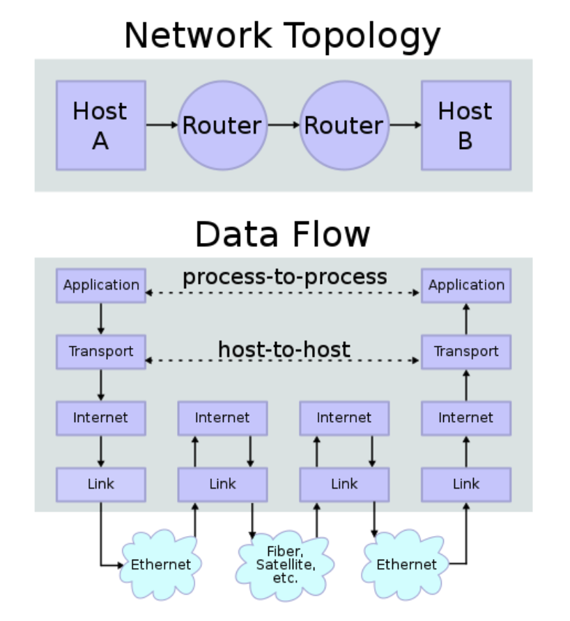

# Lecture 13

## Review: Network Protocol Layers

- Application Layer
- Tranport Layer: **Port-addressed host-to-host** communications
- Internet Layer: Fragmentation, reassembly, and end-to-end **routing of data packets**
- Link Layer: Transmission of data frames **within a local network**
- Physical Layer: Transmission of raw bits over a physical data link **connecting network nodes**.

  </img>
  </img>

### Example

- Description: Click on the link to Yahoo in UCSD network
- HTTP request (Application Layer)
- Name resolution: Where is Yahoo? (Application Layer)
- Breakdown HTTP request body and send messages using TCP (Transport Layer)
- Address each packet, so it can traverse network (Internet Layer)
- Forward packet to Yahoo's server (Internet Layer)
- In each local network, send frames on a link (Link Layer)
- In each pair of nodes, send bits via a medium (Physical Layer)

  </img>

  </img>

  </img>

  </img>

  </img>

  </img>

  </img>

## IP

- Its value is to **separate the physical networks communication to form a single logical network**
- Functions
  - Routing
    - My IP host knows location of the local router (gateway)
    - Local router (gateway) knows routes to other networks
  - Error Reporting
  - Fragmentation & Assembly
  - Time-to-Live (TTL) value
    - to prevent infinite loop
    - decremented after every hop (by each router)
    - if == 0 then discard the packet

### Header

</img>

### Fragmentation

- Basic Idea: break down a large data to multiple small fragments
- Sender writes an **identification** number to all packets (to note they are all in the same request)
- Sender writes offset to indicate position of the fragment
- Example:

  </img>

## TCP

- Its purpose is to
  - provide reliable, ordered delivery of bytes
  - establishe a stateful bi-directional session between 2 IP:port endpoints
- Each side maintains
  - Sequence number: sequence base + number of bytes sent
  - Acknowledgement number: ack base + number of bytes received
- Special packet flags:
  - SYN: start a connection
  - FIN: shut down a connection
  - RST: kill this connection now

### Header

</img>

### TCP Connection Setup: Three-Way Handshake

</img>

## TCP/IP Security

- 70s: built-in trust assumptions
  - network protocols used as intended
  - host controlled by trusted admin
- 80s: can't trust anyone
  - host are untrustworthy (comprised, public host, insider)
  - network is still trusted
- Now: can't trust anything
  - Network equipment can be compromised
  - Untrusted network operators
  - Anyone can access the physical channel of wireless networks

### Attacker Models

- Person in the Middle: see, block, modify traffic
- Passive: see, record traffic
- Off-path: inject traffic into network
- Two main issues:
  - No Confidentiality
  - No Authentication
  - Link Layer Interception

## Routing

- Is host on the local network?
  - local: send directly
  - not local: send via default network
- Create IP packet
- Create and send link layer frame
- Gateway picks next router in path and forwards the IP packet
  - continue until destination reached

### Dynamic Host Configuration Protocol (DHCP)

- Problem: How do I know my IP, address of the router, etc.
- Automatically configures each new host attached to network
- Basic Idea: Host broadcasts on the local network, and a DHCP server responds with the needed information
- Attack: DHCP Spoofing (to make victims use their DNS)
- Mitigation: DHCP Snooping (block responses from un-trusted servers)

### Address Resolution Protocol (ARP)

- Problem: How do I know gateway or destination host's MAC for Ethernet frames?
- Basic idea: query hosts on local network to get link-layer address for an IP address
- Attack: ARP Spoofing (impersonate the host)
- Mitigation:
  - Static ARP Table
  - Restrict MAC and IP addresses allowed to a single port on a switch at a time; first mover wins

### Border Gateway Protocol (BGP)

- Problem: How does the gateway know which router to forward to next?
- Basic Idea: each BGP node maintains connections to a set of trusted neighbors and neighbors share routing information
- Issue: no authorization: malicious nodes

## Attacks

- IP Spoofing Attack
  - Eve can send IP packets claiming to be from Alice
  - Eve might not receive repsonse packet from Bob, though
- TCP Spoofing Attack
  - Eve needs to complete the TCP three-way handshake between “Alice” and Bob
  - Eve needs to guess initial sequence number **y** in order to correctly ACK Bob’s SYN
- Example
  - Denial of Service: once an attacker guess the seq. # and can send RST flag to kill the connection

### Blind Port Scanning

- Context: attackers would like to know what TCP services are offered on a particular host
- But attackers want to scan anonymously
- Key trick: exploiting IP identification # in the IP header

  - used for fragmentation
  - unique across packets
  - global counter on the host presumably

  </img>

## Keywords

- Packet: a unit of chunked data sent on the Internet
