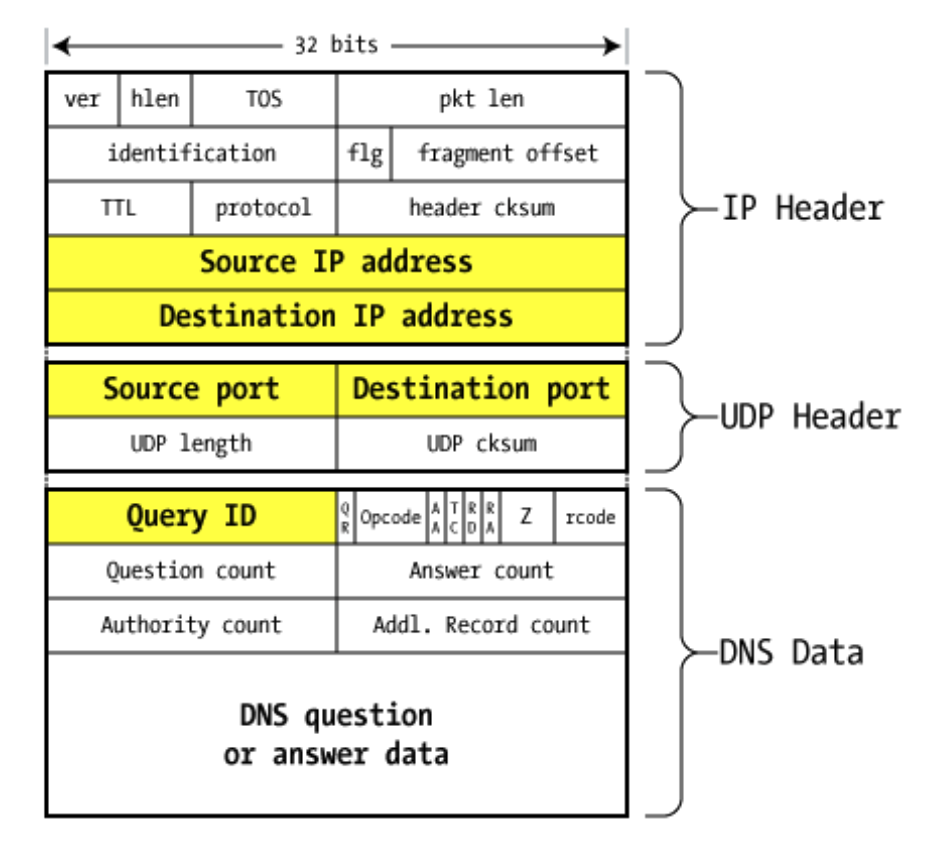

# Lecture 14

## Domain Name Service (DNS)

- Problem: humans can't remember 32bit IP numbers for all hosts
- Basic Idea: domain names
- Issue: how to map DNS names to IP addresses?
- Solution:
  - Old School: use a big file to store DNS names
  - Now: distributed name servers

### Hierarchical Name Space

- 13 root name servers for top-level domains
- Authoritative name servers for subdomains
- Local name resolvers (contact authoritative servers if they don't know a name)

  </img>

### DNS Lookup Example

- DNS Record Types:

  - NS: Name Server (point to other server)
  - A: Address Record (contains IP address)
  - MX: Address in charge of handling mails
  - TXT: generic text

  </img>

### Cache

- DNS responses are cached for future repeated requests
- Negative responses are also cached (e.g. aamazon.com does not exist)
- Cache record timesout periodically

### DNS Cache Poisoning

- Basic idea: convince DNS servers to cache a bad mapping (e.g. google.com for my server IP)
- Approaches
  - MitM Attacker: observe requests, send false responses, and block true responses
  - Passive Monitor Attacker:
    - observe requests, send false responses before true responses
  - Off-Path Attacker:
    - know when the server makes the request, flood false responses
    - challenge: match the request with false responses

### DNS Packet

</img>

### DNS Request & Response

</img>
</img>

### Attack #1

- Take advantage of the additional sections
- Add false addresses to other domains to "poison the cache"

  </img>

### Defense #1: Bailiwick checking

- Only cache the records from the same domains
- i.e. `a.com` can't cache records for `b.com`

### Attack #2

- Arbitrary DNS poisoning
- Send a non-existent record and send a lot of false responses to its own request (to match QID)

  </img>

### Defense #2

- Increase query ID size
- Randomly vary the capital size
- Authenticate response/requests (only a few DNS services)

### DNS Cache Poisoning Summary

- Current DNS system does not provide strong evidence binding request to response
- Response can provide more data than was asked for
- Together allows attacker to “poison” DNS and divert traffic to their sites

## Network Perimeter Defenses (Firewall)

- Problem: protect a part of networks from the others
- Need to filter or limit the network traffic
- Types
  - Personal Firewall: end host, more customized
  - Network Firewall: intercept and evaluate traffic for many hosts
- What they filter:
  - packets: filtering on packet headers content
  - proxy-based: filtering at the application level (HTTP Web Proxy)

### Common Deployment Strategy

- Filter protect against “bad” communications
- Protect services offered internally from outside access
- Provide outside services to hosts located inside

  </img>

### Access Control Policies

- Who is allowed to talk to whom and access what services
- Distinguish between inbound and outbound connections
- Defaults
  - allow
  - deny

### Packet Filtering Firewall

- Define a list of rules
- Check every packet against rules to decided forward or drop
- pros:
  - see Internet and Transport layer of information
  - IPs, ports, TCP flags
- cons:
  - everything gets through with ports not blocked by the firewall (80, 443)
  - can’t distinguish packets associated with a connection or not
  - some maintain states but can only look at packet headers
  - limiting understanding of application level content
- Typical Examples
  - blocking incoming DNS requests except from trusted hosts
  - blocking incoming HTTP requests except to the org's public web server
  - block outgoing packets with sources not from the org
- Example
  - Only allow SSH inbound, all outbound from particula network
    </img>

### Proxy-Based Firewall

- Proxy acts like both a client and a server.
- Able to filter using application-level info

  </img>

### Network Content Security

- Some want to look at network traffic content for security
  - Network Intrusion detection/prevention Systems (NIDS/NIPS)
    - Try to find signatures of attacks or malware
  - Spam Filter
  - Data Leakage
  - Traffic Differentiation
    - Filter or slow down BitTorrent traffic, Netflix traffic, etc
- pros
  - cheaper than deploying these services to each host
- cons
  - expensive to look into each packet (even need to assemble)
  - network vantage is imperfect (encrypted session, network envation)

#### Network Envasion

- Key Assumption: NIDS sees the same traffic as destination host
- Approaches
  - TTL evasion
  - Sequence # evation
- Protocol normalization
  - Firewall rewrites all packets to remove ambiguity
  - hard and expensive

#### TTL Evasion

</img>

#### Sequence # Evasion

</img>

## Denial of Service

- Attack against availability, not confidentiality, integrity, or authenticity
- Types:
  - Logic vulnerabilities: exploit bugs in network code to cause crash
  - Resources consumption: overwhelm with fake requests

### Resource Consumption

- Computation Resources
  - overwhelm with connection states (SYN flood)
  - wait a long time to reply to messages
  - make DB process a lot of queries
- Network Resources
  - small packets flood (packet-per-second limit on routers)
  - big packets flood (exceed forwarding capactiy and drop good packets)

### Defense #1: Address Spoofing

- Source Address Validation: filter packets with clearly bad source addresses
- SYN Cookies: like a hash function that takes `src,dst,srcport,dstport,time` (unique to each connection)

### Defense #2: Packet Filtering

- Filter by bad information
- Add good info to flows that are good (complete 3 way handshake)
- Rate-limit sus packets instead of dropping

### Defense #3: Buy More Resources

- Each attacker gets diverted (i.e., via DNS) to local CDN server instead of target
- Issue: $$$

### Special Attack: Reflection Attack

- Spoof victim's source IP address
- Send a lot of requests to DNS servers with victim's IP
- Overwhelm victim server by DNS responses

## Keywords

- glue: records that contain the IP addresses of the next NS servers
- inbound: coming into an internal network
- outbound: coming out of an internal network
