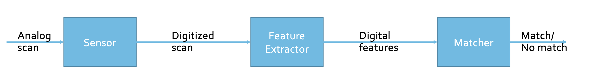

# Lecture 15

## Authentication

- Authenticate: figure out who is interacting with the system
- How: ask the human to provide identity and proof of identity
- Authentication Factors
  1.  Password: Something you know
  2.  Token: Something you have
  3.  Biometrics: Something you are

## Password: Something You Know

- How: Alice provides it to the system
- Problem:
  - Passive Eve: observe
  - Active Eve: impersonate the system (phishing)

### Phishing

- Prevention: Authenticate the system
- For example,
  - use HTTPS certificate to validate the URL? (NOOOO)
  - it only says that connection is secure
  - users are expected toknow which domains are associated with the entity they are trying to interact with

### Attacking Password

- Between Alice and her computer: shoulder-surf, side channel, key loggers
- In her laptop: software keylogger, password in memory (clipboard), stored password (text file, pwd manager, cache)
- In remote system: try multiple passwords

### Protecting Password

- How to verify what Alice enters is the password?
- Naive: Store a copy of the password and compare
- Issue: if system is compromised, then the password is revealed

#### Sol #1: Hash

- Use a hash function to hash the password and store the hash
- Issue: Given a hast of a pwd, attacker can use it to verify their guess
  - Dictionary Attack: pre-compute all possible passwords (in a dictionary) and perform reverse look up

#### Sol #2: Salt & Slow Down

- Use a random n bits called salt and store the hast like this `H(salt || pwd)`
- We can also use a deliberately slow hash function to make it even harder

### Token: Something You Have

- Something only Alice should have
- Use the proof of possession to authenticate (not sure if its really Alice)
- Examples
  - SmartCard: put a secret key in a small computer
  - One-time passcode token
  - USB/NFC Token
  - One time passcode without token

#### One-time Passcode Token

- Same basic idea as the smartcard
- Display the token and have the user type it ot the system
- Typical Protocols:
  - symmetric key crypto (between the device and the system)
  - periodically generate a new token and MAC the current time
- pros:
  - each code is single use
  - can't predict the future ones by the previous ones

#### USB/NFC Token

- The same as one-time passcode token
- But **device-to-device** and **not display the passcode**

#### One Time Passcode Without Tokens

- pros: better scaling, support multiple keys with the same physical device.
- cons: not isolated anymore
- Extending the idea of using (possession of) your phone as an authentication factor.
- Medium:
  - SMS
  - Email
  - Mobile Apps

## Biometrics: Something You Are

- Something unique identifying characteristic that only Alice has
  - physical: fingerprint, iris print
  - behavioral: handwriting, typing
  - combined: voice, gait
- challenges
  - accuracy
  - ease of use
  - privacy
  - spoofing (unique but not secret)
    - mitigations: multi-modal, liveness (pulse)

### General Approach

- Get the sample from the user (e.g. scan)
- Convert the sample into a digial format
- On enrollment, save the template of the features
- On authentication, test the features against the stored template

  </img>

### How?

1. Sensor: Local, Extractor: Remote, Matcher: Remote
2. Sensor: Local, Extractor: Local, Matcher: Remote
3. Sensor: Local, Extractor: Local, Matcher: Local

## Keywords:

- Step-up authentication: secondary (stronger) authentication mechanism invoked based on risk level
