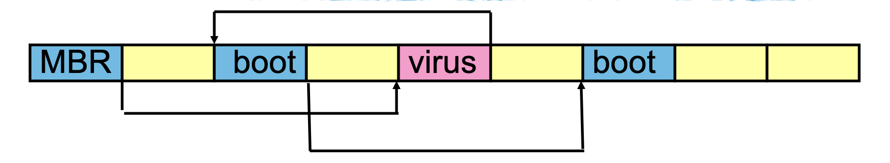

# Lecture 16

## Virus & Worms

- Replicating malicious programs
  - Viruses: replicate by attaching to a host program (driven by human actions)
  - Worms: replicate via networks (self-spreading)
- Goal: spread, hide from detection
- Types:
  - Bootstrap Virus
  - Memory Resident Viruses
  - Encrypted Viruses
  - Polymorphic/Metamorphic Viruses

### Bootstrap Viruses

- Old school Bootstrap Process: firmware copies boostrap code to the memory
- MBR (or Boot Sector): fixed on disk, “Chained” boot sectors for longer bootstrap Loaders
- Virus breaks the chain, inserts virus code, reconnects the chain

  </img>

  </img>

- This is the only way to spread back in pre-internet days
- Protection:
  - Bootstrap Scanning Tools
  - Secure Bootstrap (having signatures on bootstrap code)

### Memory Resident Viruses

- Standard Infected Executables
- First attemp: insert it to the beginning of the executable
- Second attemp: insert it to the end of the executable and have a jump instruction at the beginning

   
   
   

- Detection:
  - Head/Tail Scanners: because most virus back then are only attached to head or tail
  - (Attackers then move virus to the middle of the executable)
  - Scalpel scanning: scan all instructions, if jmp or call, trace, else scan all fingerprints in that region

### Encrypted Viruses

- When infecting a new file, the virus changes the encryption key so the body looks different.
- The virus contains a decrypt loop that runs first, decrypts the body, and then runs the body
- Still easy to detect because the decryption part is static

### Polymorphic Viruses

- When infecting a new file, the virus generates a new decryption code
- Inserts both the new decryption code and the encrypted body to a new target file

    

- Extremely hard to detect: Generic Decryption

#### Generic Decryption

- Key idea: let virus do the hard decryption work for you
- Emulate the virus execution in a VM and wait until it decrypts
- Assumptions
  - it gains control of the host immediately
  - it decrypts itself deterministically
  - it has some static body that can be detected with traditional signatures
- There are still a lot of problems left...

### Metamorphic Viruses

- These viruses rewrite their logic in each new infection!
- They have no byte-level fingerprint anywhere!
- Metamorphic viruses use the current infection’s code as a template
- then expand and contract sets of instructions within the body to create a child infection.

## Malware Detection

- Scanning (signature)
- Integrity Checking
- Behavioral Detection

### Integrity Checking

- Change Detection
  - Assume programs are all good when first installed
  - Compute a one-time hash of the program once downloaded
  - Periodically check the hash to detect changes
- Allowlisting
  - Import list of _**known good**_ software (again one-way hashes)
  - Validate that all programs on disk hash to something on the whitelist
- Challenges
  - whitelist must be well protected
  - whitelist must be comprehensive and kept up to date
  - doe not work well with editable documents

### Behavioral Detection

- Identify suspicious behaviors in software
  - code decryption in memory
  - unusual instructions
  - unusual use of file systems or network interfaces (send copies of code)
- Software reputation
  - where is it from?
  - does it correlate with the past malwares?
- Can run during runtime, amendable with machine learning approaches
- Challengs:
  - Suspicious != malicious; false positives

### Disinfection

- Standard Disinfection
  - find virus, find original host file beginning, find size of virus
  - move original code to beginning and truncate file to eliminate virus code
- Generic Disinfection
  - run program and emulate until it restores the file to its normal state
  - rewrite cleaned program back to disk
  - issues:
    - viruses that overwrite code
    - viruses that have unknown entry points
- Practical Solution:
  - wipe and reinstall everything

## Network Worms

- Morris Internet Worm
  - Buffer overflow in fingerd
  - DEBUG mode left enabled in sendmail
  - Dictionary attacks on /etc/password
  - Infected ~6,000 major Unix machines
- Email-based worms (required humans interaction)
- CodeRed worm
  - Exploited buffer overflow in IIS
  - Uniform random target selection
- Slammer
  - Hits peak BW in 3mins
  - Scans 90% of Internet in < 10mins

### Outbreaks Measurement

- Simplest model: Homogeneous random contacts
- Classic SI model
  - N: population size
  - S(t): susceptible hosts at time t
  - I(t): infected hosts at time t
  - ß: contact rate
  - i(t): I(t)/N, s(t): S(t)/N
- Objectives of an outbreak:
  - How **likely** is an infection attempt is successful?
  - How **frequently** are infections attempted? (ß: contact rate)
- Approaches
  - **Prevention**: reduce S(t) while I(t) is still small
  - **Treatment**: reduce I(t) after the fact
  - **Containment**: reduce ß while I(t) is still small

### Network Telescopes

- Monitor **large range of unused IP addresses**
- If worm scans **randomly**, will hit telescope repeatedly

### Other Mechanisms for Spreading Malware

- Drive-by Downloads
- Social Engineering
- File Sharing Networks

## Notes

- Assumptions of signature-based anti-malware software:
  - Malware is known a priori (i.e., there are good signatures that can be extracted)
  - Malware is used again (i.e., that discovering new malware instance is useful)
  - Malware signatures are widely distributed (cost/benefit)
