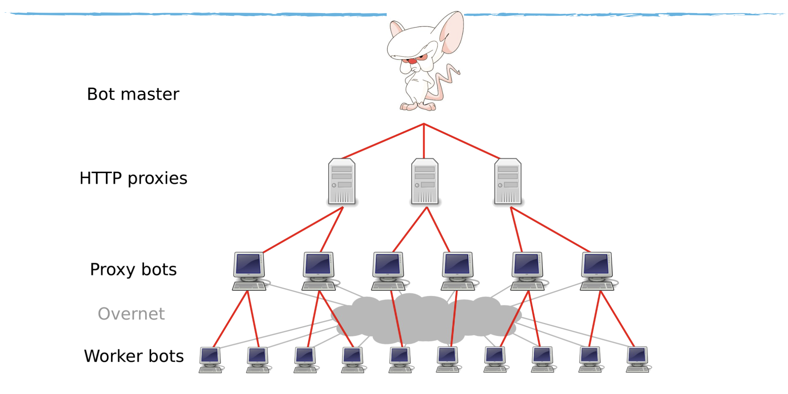

# Lecture 17

## Botnets

- A network of **compromised computers** with a common command & control system
- The bot controller sends commands via the network to get botnet to do something
  - spam/phishing
  - denial of service
  - click fraud
  - stealing local data (pwd, credit cards)
  - ransomware
- Architectures
  - Centralized
    - Web server
    - Multiple servers for robustness
  - Peer-to-peer: self organizing
    - Each host can be a worker or a proxy
    - Multi-level hierarchy forwards traffic back to controller
      </img>

### Update & Recovery

- Auto Update
  - bot requests C2 for updates and if so, download them
- Resilience/Recovery
  - if someone takes over the C2
  - then scan alternative C2's

### How to Deal with Botnets? (Defense)

- Detection
  - detect malware
  - detect network access to known C2's
  - allow **_honey pot_** computer to be infected and see what that do to trace the C2
  - take over C2 and see what hosts connect to it (infected workers)
- Next?
  - Get users to clean up the malware
  - Quarantine from the network
  - Shutdown C2 or disrupt its behavior
  - Takeover C2 and command bot to uninstall themselves

### What to Do with Botnets? (Attack)

1. Spam
   - provides solution to attacks of spamming with one IP and being blocked
2. Economic usage
   - Sell/Rent the botnets as **_platforms_**
   - SPAM, piracy, phishing, DDoS are all **_applications_**
3. Click Fraud
   - Click on own ads for revenue
   - Defense: try to identify fraudulent patterns
4. Infostealers
   - best infostealers can defeat 2-factor authentication
   - commercial: credentials for online services, cards, etc.
   - espionage: documents of value

### What to Do with Stolen Money? (Cashout)

- Direct monetization
  - White plastic: create new cards and do withdrawals
  - Wire transfer: **_money mules_** will withdraw and tranfer to other banks
- Reshipping fraud:
  - Purchase goods online
  - Reshpping mules receive items and reship to overseas locations
- Fraud: Fake Anti-Virus
  - offers to clean the machine with subscriptions
- Ransomware: encrypt local files and ask owner to pay to unlock
  - fraudulent: impersonate some authorities and ask for payment
  - extortion: straight up ask for payment or files gone

## Largest Application: SPAM

- Reasons
  - Marketing
    - Selling goods/services
    - Stock spam
    - Advanced Fee Fraud (419 scams)
  - Attraction (taking you to a site)
    - Phishing
    - XSS, CSRF attacks
    - Drive-by malware
  - Infection via attachments
- Approach
  - Harvesting (web crawling, mail list crawling)
  - Stealing from enterprises
  - Purchasing mailing lists

### Sending Spam

- Base message composition
- Mass mailing program
  - Interface with target lists
  - Add polymorphism/specialization/personalization
  - Connect to delivery infrastructure
- Delivery infrastructure
  - send from own machines
  - Launder origin via open relays/proxies
  - Launder origin via Email service provider
  - Launder origin via **botnet**
- Result
  - Direct marketing meets botnets -> 100B spam/day

### Defenses

- Block reception
- Change economic model
- Change addressing model
- Legal remedy

### Block Reception

- Blocklisting
  - honey clients (dummy email accounts)
  - user reports
- Sender Authentication
  - Validate that purported origin domain
  - Sender Policy Framework (SPF)
    - do DNS lookup, get a list of IPs allowed to send emails from that domain
  - DomainKeys
    - get signature from request header
    - get public key from DNS and verify the signature
- Content Filtering
  - Phrase/keyword filtering
  - Heuristics (all cap letters, spoofy ip)
  - Learning approaches

### Affiliate Programs Structure

- Affiliates handle advertising (spam, SEO)
- Affiliate programs handle backend
  - payment processing
  - hosting and domain registration

### Click Trajectory

- Find **_bottlenecks_** in the spam **_value chain_**
- Place where intervention could be most effective
  - Resources with largest impact on profitability
  - Highest switching cost for adversary
