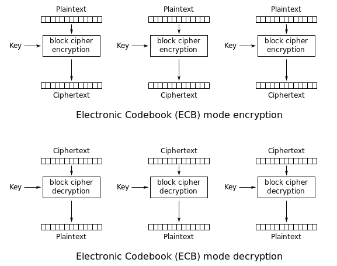
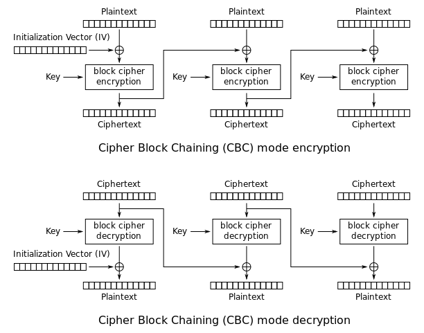
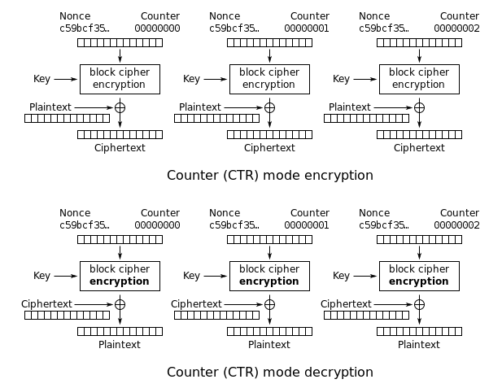
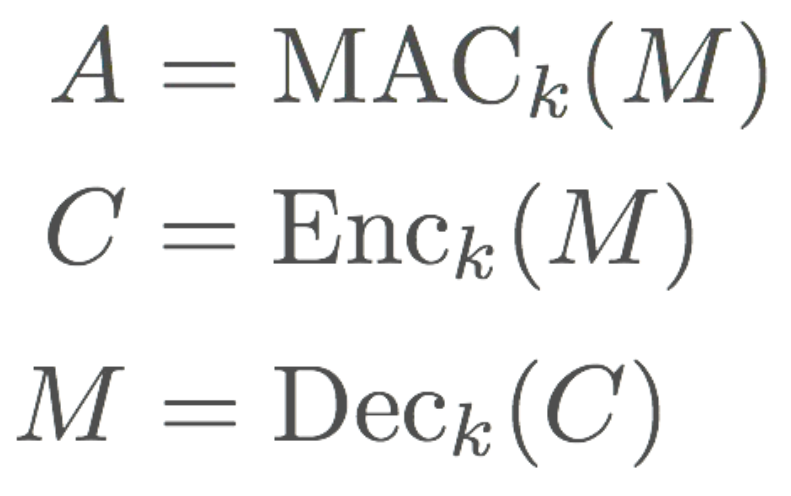
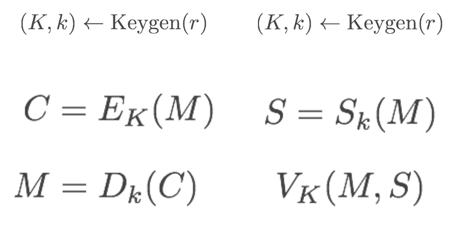

# Lecture 9

## Cryptography

- Cryptography provides mechanisms for enforcing **confidentiality and integrity** across **time and space controlled by adversary**

### CIA Review

- Secrecy: no one else can read the message
- Integrity: message can not be modified
- Authenticity: parties can not be impersonated

## Attackers

- Passive attacker: read only
- Active attacker: can read, create, and possibly modify, block
- **Man in the middle** (MitM) attacker: can read, create, modify, block

## Basics

- Know the threat model
- Know whether we should protect C or I or both
- Know whether the attacer is passive, active, or MitM

## One-Time Pad

- perfect secrey if we XOR m with a random stream of bits only known to both parties
- every plaintext is equally probably (random stream)
- cons:
  - requires a lot of pre-arranged secrets
  - each pad can only be used once
  - no integrity and authenticity

## Symmetric & Assymmetric Cryptography

- Symmetric Cryptography
  - both parties share a secrety key to communicate
  - random bit strings
- Assymetric Cryptography
  - public keys: used for unprivileged operations
  - private keys: used for privileged operations (secret)
  - public and private keys are related in algorithm-dependent way

## Cryptographic Primitives

- Encryption: C but no I
  - Formally: adversary can't distinguish which of the two plaintexts were encrypted with knowing the key
- Message Authentication (symmetric) and Digital Signature (assymmetric): I but no C
  - Formally: adversary can’t generate a valid MAC or signature for a new message without knowing the key.

## Hash Functions

- A function that maps arbitrary length input to a fixed-size string
- pre-image resistance
  - given an output, impractical to find an input
- collision resistance
  - impractical to find two inputs that has the same output

## Message Authentication Code (MACs)

- Goal: validate messsage integrity based on a shared secret
- A function that takes a message and a key
- impractical to forge without the key

## Symmetric Cryptography

- pros: C
- cons: no I/A, impractical to share large secrets

### Cryptographic Randomness

- given the first n bits of a random sequence, can't predict the next bit with probability > 0.5
- even if the internal state has been revealed, can't reconstruct the numbers prior to the revelation

### Stream Cipher

- generate a random string of bits **as long as the palintext** and xor them
- encrypt: XOR with m
- decrypt: XOR with c
- **Insecure if key used more than once**
  - need to generate one-time key from a master key
  - or a random init value on each use

### Block Cipher

- encrypt/decrypt using a fixed-size block of bits
- shorter blocks? pad m to full block size
- longer blocks? chain individual blocks
  - methods of chaining are known as **modes of operation**

#### Electronic Code Book (ECB) Mode

- Naive mode of operation
- encrypt/decrypt each block separately
- cons: not so good at hiding the patterns

  </img>

#### Cipher Block Chaining (CBC) Mode

- XOR c block into next m
- cons: not so good at hiding the patterns if attacker knows IV and m

  </img>

#### Counter Mode (CTR) Mode

- Encrypt successive counter values and XOR with m

  </img>

## Assymetric Cryptography

- two keys: public key, private key
  - keys are algorithm-dependent
- C: encryption/decryption
- I/A: signing and verification
- **messages are fixed size**
- **more expensive than symmetric**

### Signing and Verificaiton

- signing using private key
- verification using public key

## Symmetric + Assymetric

- Generate a one-time symmetric key
- Encrypt message with the symmetric key
- Encrypt the symmetric key with the public key
- Send encrypted message and encrypted symmetric key
- Decrypt the symmetric key with the private key
- Decrypt the message with the symmetric key

## Symmetric Primitives

</img>

## Assymmetric Primitives

</img>

## Notes

- Confidentiality and integrity are protected by **different cryptographic mechanisms**!
- Kerckhoffs's Principle: A crypto system should be secure even if everything about the system is public, except the key

## Keywords

- Plaintext (m): unencrypted message to be communicated
- Ciphertext (c): encrypted version of the message
