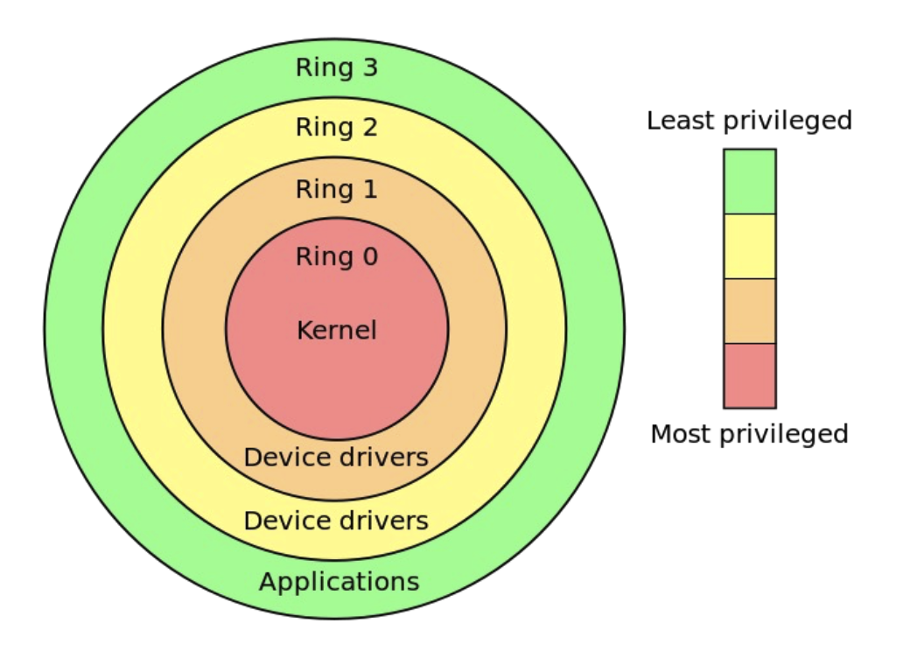
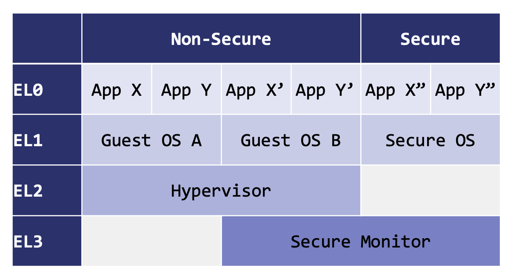
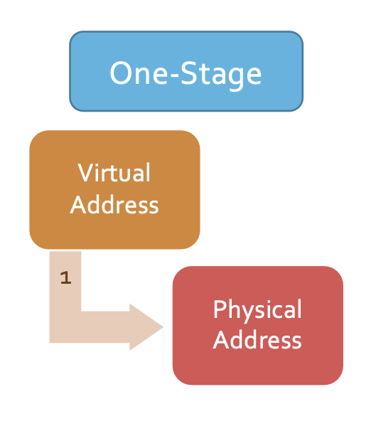
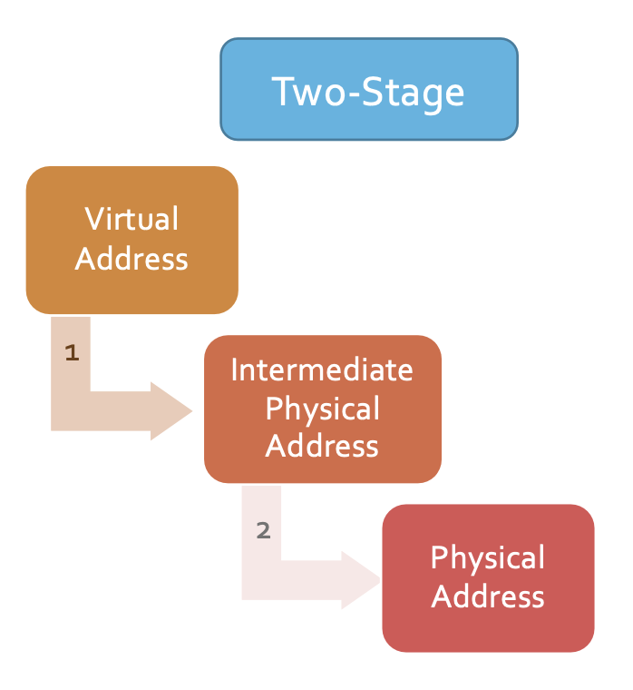

iim# Lecture 7

## Key Secure Design Principals

- Least Privilege
  - Only provide as much privilege to a program as is needed to do its job
- Privilege Separation
  - Divide system into different pieces, each with separate privileges.
- Complete Mediation
  - Check every access that crosses a trust boundary against security policy
- Defense in Depth
  - Use more than one defense
- Simple Designs Are Preferred

## How to Follow Them in Modern OSs

- Process Abstraction
  - Each user has >1 processes and each proces has a UID to identify its user
- Process Isolation
  - Keep processes from interfering with other's memory or state
- User/Kernel Separation
  - Limit privileges to OS kernel
  - Check requests from user against security policy
  - Protect operating system kernel from user processes

## Process Isolation

- Process boundar is a trust boundary
- **Virtual Memory Space** is the primary mechanism for process isolation

## Privilege Levels

- Sensitive system operations require certain minimum privilege level
- Boundary between privilege levels is a trust boundary
- Dedicated mechanisms for safely changing privilege level are needed
  - Each privilege level defines a set of entrypoints for less privileged callers
  - This is what a system call is
- Intel Privilege Levels

  </img>

- ARM Privilege Levels (2 worlds, 4 exception levels)

  </img>

## System Calls

- User-mode process may need frequent assistance from kernel
- System calls are common so need to be fast
- To make system calls fast, kernel's virtual memory space is mapped to every user-mode process
- But it is NOT accessible in user mode

## Kernel Security

- Threat Model:
  - C.I.A of kernel's memory and state needs to be protected from user-mode processes
  - User-mode processes are untrusted and could be potentially malicious
- Operating Model:
  - User-mode makes frequent calls to kernel with data passing back and forth

## Null Dereference

- _What if that process mapped page 0?_ (where null is)
- And _what if we trigger the null dereference in kernel?_
- Instead of crashing, the kernel will use attacker-controlled data on page 0
- This is called **return-to-user** attack
- Potential solution: prevent unprevileged allocation of page 0

## Virtual Machines

- Same isolation but between OSs
- Will need multiple stages of translation

  </img>
  </img>

## Keywords

- Memory Access Polymorphism:
  - Different access implementations for different memory regions / types
  - Access controls like read, write, execute
- Translation Lookaside Buffer (TLB)
  - Small cache of recently translated page addresses
- “Nothing will ever be more privileged than the kernel”
  - wrong because advanced intel processors include multiple modes more privileged than the kernel
- “Nothing will ever be less trusted than a user mode application”
  - wrong because of user-level sandboxing of code within a browser
