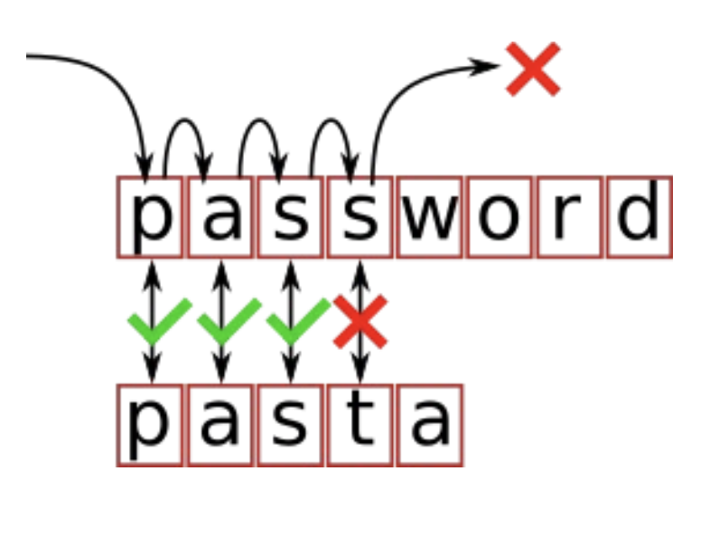
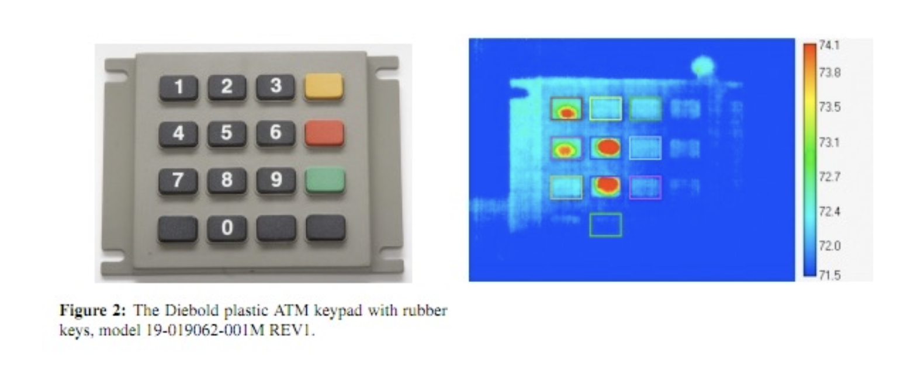
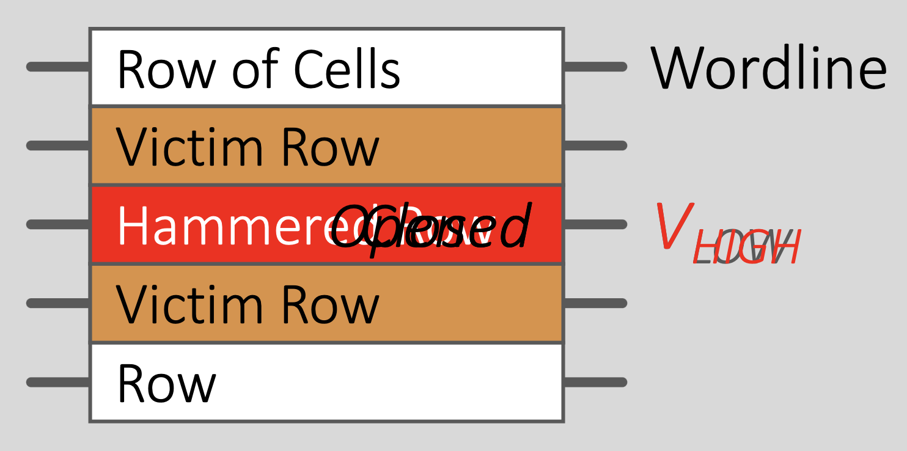
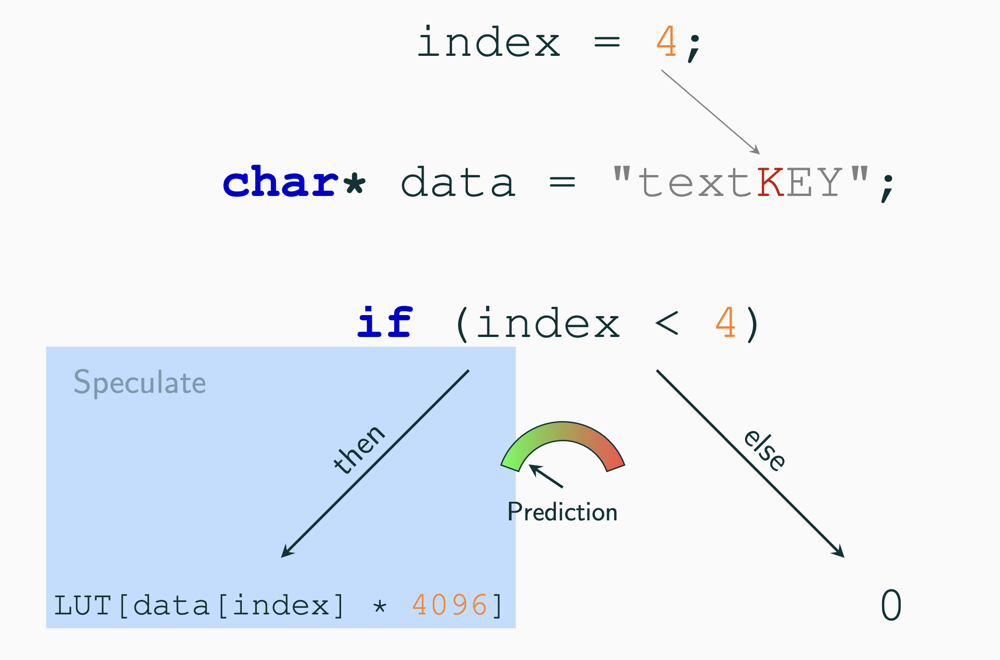

# Lecture 8

## Side Channels

- We often think that systems as black boxes and ignore the side effects
- The side effects can often reveal critical information
- Side channel is **a source of information beyond the output specified by the abstraction**
- For example
  - consumption: time, energy, memory, network
  - emission: radiation, movement, error messages

### Mitigate Side Channels

1. Eliminate dependency on secret data
2. Make everything the same
   1. Use the same of amount of resources every time
   2. hard, expensive
3. Hide
   1. Blinding can be applied to input for some algorithms
4. Adding Random Noice
   1. Attacker just needs more measurements to extract signal

### Examples

</img>
</img>

## Cache Side Channel

- Cache is a shared system resource
- It has no impact on contents of reads but the time that a read takes
- Threat Model
  - Attacker is able to invoke functionality exposed by the victim
  - Goal: we don't want the attacker to be able to infer anything about the contents of victim memory
- Some algorithms have memory access patterns that are dependent on sensitive memory contents
- Attacks
  1.  Prime: place a known address in the cache (by reading it)
  2.  Evict: access memory until a given address is no longer cached (force capacity misses)
  3.  Flush: remove a given address from the cache
  4.  Measure how long it takes to do something

### Evict & Time

- Run the victim code and time it (baseline)
- Evict portion of cache
- Rerun and retime it
- If it is slower, then the evicted line must be used by the victim

### Prime & Probe

- Prime the cache by accessing many memory locations
- Time each cache line to see how long each takes
- Run the victim
- Rerun original cache line to see if any are slower

### Flush & Reload

- Specifically for shared memory
- Time memory access to shared regions
- Flush the cache (now all access to the share regions should be slower)
- Run the victim
- Retime the flushed addresses
- Victim use them if they are still fast

## Rowhammer

- Repeatedly opening and closing a row enough times within a short amount of time interval
- This could induce the disturbance errors in the adjacent rows
- Potential Solutions

  - Error Correction Code (ECC) check on read (add cost)
  - Add limitation on hammering or refresh adjacent lines
  - Process changes to mitigate inter-row effects

  </img>

## Meltdown

- Using out-of-order execution, we can read data at any address
- This is because privilege checks are sometimes too slow
- This will allow us to leak kernel memory
  > Meltdown breaks the most fundamental isolation between user applications and
  > the operating system. This attack allows a program to access the memory, and thus
  > also the secrets, of other programs and the operating system.

### Example

- Run the following code and check if any part of `array` is cached

```c
char data = *(char*)0xffffffff81a000e0;
array[data * 4096] = 0;
```

## Spectre

- The main issue is that the processor tends to speculate on branch
- The speculation might lead to executing some illegal instructions ahead and leak memory
- For example, we accidentally leak the K character in this case:

  </img>

## Key Notes
