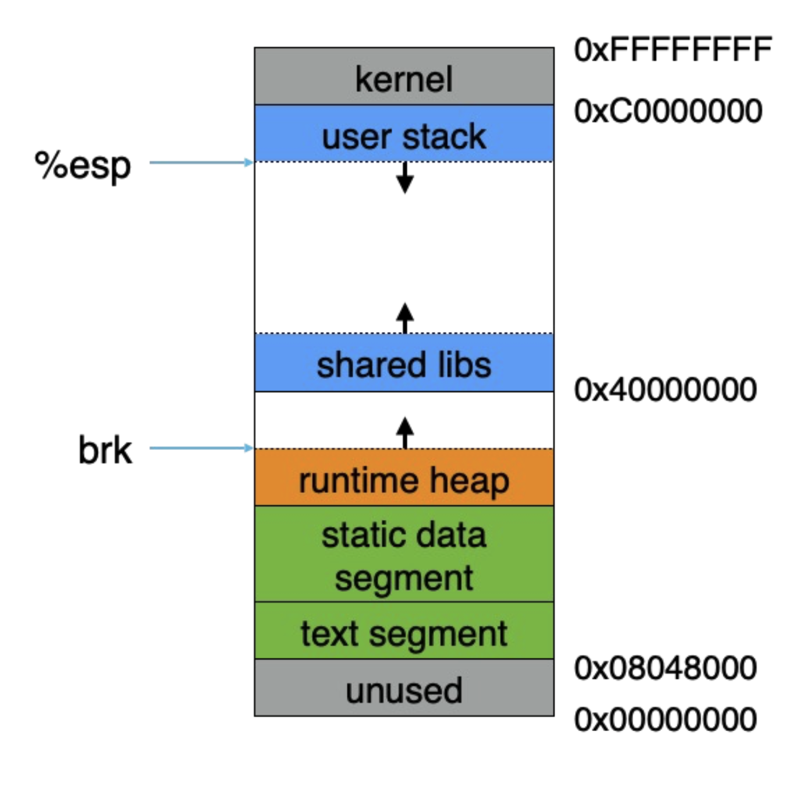
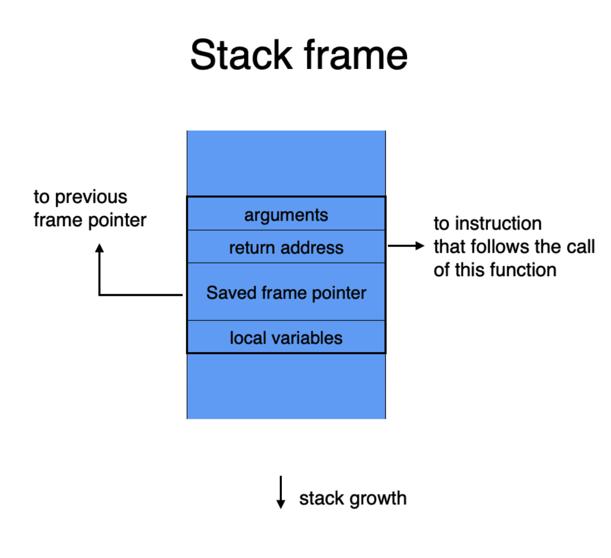
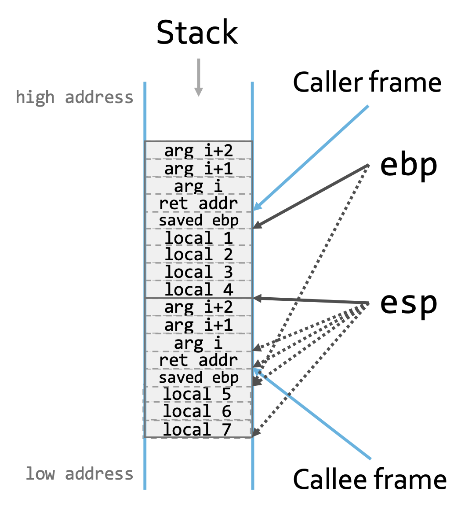
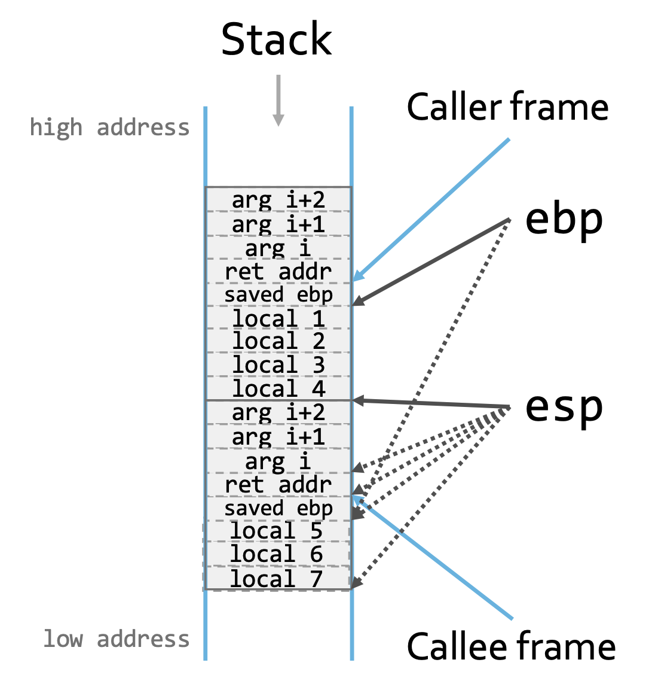
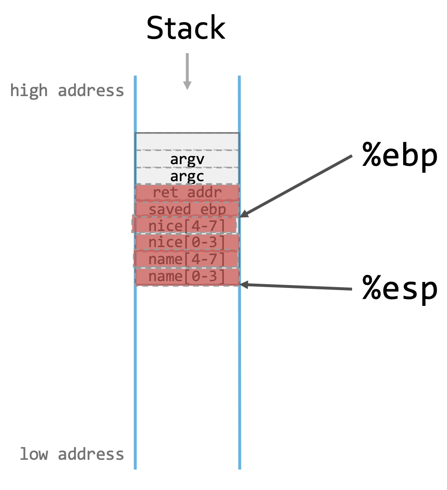

# Lecture 3

## Review

### Process Memory

</img>

### Stack

- Stack is divided into Frames
- **Stack pointer** points to the top of the stack
- **Frame pointer** points to the caller's frame on the stack (base pointer)

</img>

### Function Call

</img>
</img>

### Basic Instructions

- `movl %eax, %edx` $\rightarrow$ `edx = eax`
- `movl $0x123, $edx` $\rightarrow$ `edx = 0x123`
- `movl (%ebx), %ed` $\rightarrow$ `edx = *((int32_t *) ebx)`
- `movl 4(%ebx), %ed` $\rightarrow$ `edx = *((int32_t *) ebx + 4)`

### Stack Operations

- `pushl %eax` $\rightarrow$
  - `subl $4, %esp`
  - `movl %eax, (%esp)`
- `popl %eax` $\rightarrow$
  - `movl (%esp), %eax`
  - `addl $4, %esp`
- `call $0x12345` $\rightarrow$
  - `pushl %eip`
  - `movl $0x12345, %eip`
- `ret` $\rightarrow$
  - `popl %eip`
- `leave` $\rightarrow$
  - `movl %ebp, %esp`
  - `popl %ebp`

## AT&T vs Intel Syntax

- AT&T: instruction src dst
- Intel: instruction dst src

## Buffer Overflow Example

Consider the following piece of C program with these inputs:

- Notsoni
- Notsonice
- Notsoniceatallnoreally...

```c
#include <stdio.h>
#include <string.h>

int main(int argc, char**argv) {
  char nice[] = "is nice";
  char name[8];
  strcpy(name, argv[1]);
  printf("%s %s\n",name,nice);
  return 0;
}
```

### Issue

- With an input that is too long, we will overflow the memory like this because `strcpy` stops at terminate string `\0`

  </img>

### Solution #1: restrict the number of bytes copied

- People then propose to use `strncpy` and `strncat`
- However, we **can NOT ensure that the result string is null terminated**

## Spot Buffer Overflow Exploit

- Missing Check
  - No test to make sure memory writes stay within intended bounds
- Avoidable Check
  - test memory writes stay within intended bounds
  - issue: can be bypassed by providing right inputs for the test (avoidable)
- Wrong Check
  - The test is simply wrong

## Keywords

- control flow integrity: lets attacker run unallowed code of their choice on your computer
- Buffer Overflow: a program writes data beyond the boundary of a buffer

## Key Notes

- An **exploit** is a mechanism by which an attacker triggers unintended functionality in the system
- Security requires understanding the intended & unintended functionality (developers' blind spots)
- An attacker can **direct the execution** of your program by **manipulating input data** it acts on.
- Assume input can be malicious. Always **validate lengths and bounds** before accessing arrays.
- **Separate control data from user data** where possible
- Default ways of doing something are often insecure. Investigate security aspects of tools, frameworks, libraries, APIs, that you are using and understand how to use them safely.
