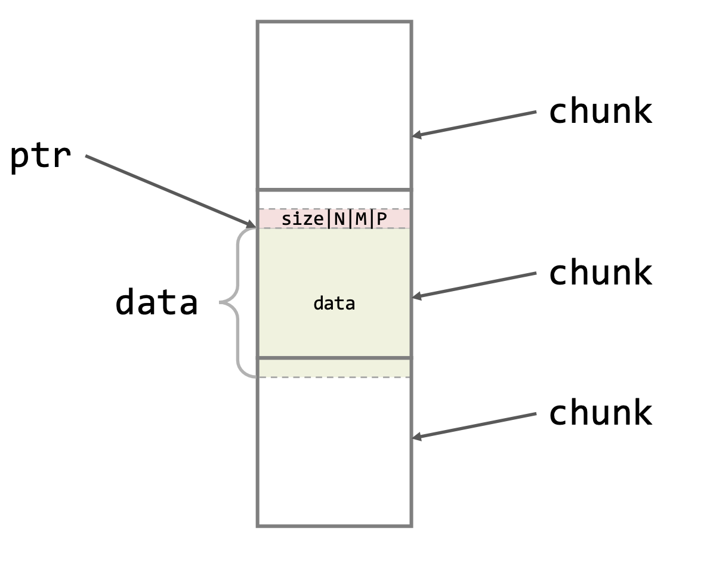

# Lecture 4

## Other Control Overflows

1. Format strings
2. Integers and integers overflow
3. Heap vulnerabilities

## Format String Vulnerabilities

- format specifier: **%[flags][width][.precision][length]specifier**
- specifier:
  - %s: string
  - %d: signed decimal integer
  - %x: unsigned hexadecimal integer
- flags: sign, padding, ...
- length: size of argument
  - h: char
  - hh: short
  - l: long
  - ll: long long

### Variadic Functions

- C supports functions with a variable number of arguments
- How does the called function know how many arguments were passed
- Options
  - Another argument explicitly specifies count?
  - The last argument is a reserved terminator value?
  - Another argument implicitly encodes count? (**printf**)

### Caller & Callee

- Caller
  - Pushes arguments onto stack
  - Pushes pointer to format string onto stack
- Callee
  - Parses the format string
  - Use the format string to read corresponding arguments off stack
- Example
  ```c
  char fmtstrng = "%d\n";
  printf(fmtstrng,10);
  ```
  </img>

### Potential Issues

- User is responsible for enforcing one-to-one mapping between format specifiers and arguments
  - What if there are too many arguments?
  - What if there are too few arguments?
- Not a good idea to let an attacker feed arbitrary commands (format string) to your command interpreter (printf)
- With a well-crafted format string, an attacker can do:
  - read arbitrary memory
  - write arbitrary memory

## Heap Vulnerabilities

- Potential Issues
  - _What if the attacker is able to corrupt data on the heap?_
  - _What if the attacker can use `malloc` and `free` in an unexpected combinations_

### Heap Abstraction vs. Reality

- Abstraction
  - Dynamically allocate and release memory buffers as needed.
- Reality
  - _Where does this memory come from?_
  - _How do we know how much memory to reclaim when free() is called?_

### Heap Basic

- The heap is managed by the heap manager
- It maintains contiguous **chunks** of available memory
- These chunks are stored in doubly-linked lists (**bins**)

### Chunks

- variable size
- status: free / in use
- meta-data
  - size
  - flags
    - N: Non main arena (not relevant)
    - M: is Mmaped (not relevant)
    - **P: Previous chunk is in use**
- user data
- **the last word of the data block is the first word of the next chunk**
  </img>

#### In Use

- malloc $\rightarrow$ return a pointer to the start of the data block
- free $\rightarrow$ release the chunk by looking at the meta data

#### Free

- Free chunks are stored in double-linked lists (bins)
- Consecutive free chunks are coalesced
- The last word of the free chunk is the size of the free chunk to make it easier to coalesce two free chunks

### Use After Free Vulnerability

- Typically, the malloc function will return the pointer to the last freed chunk
- But might lead to unsafe memory in multi-threaded applications
- For example

  ```c
  char *p, *q;

  p = malloc(20);
  snprintf(p, 20, "Hi");
  printf("%s\n", p);
  free(p);

  q = malloc(20);
  snprintf(q, 20, "Bye");
  printf("%s\n", p); // will print "Bye"
  free(q);
  ```

### Double Free Vulnerability

```c
a = malloc(10);
b = malloc(10);
c = malloc(10);
free(a);
free(b);
free(a);
d = malloc(10); // uses memory returned from free(a)
e = malloc(10); // uses memory returned from free (b)
f = malloc(10); // uses memory returned from free (a)
//... now d points to f
```

### Potential Solutions

1. Safe heap implementations

- safe unlink (check all pointers)
- cookies on heap allocation
- integrity check on malloc, free
- encrypt heap function pointers
- randomize heap chunk metadata

2. Use Garbage Collection
3. Centralize memory usage

## Integer Vulnerabilities

### Integer Type Converion

- Truncation
  - when a value with a **wider** type is converted to a narrower type
    ```c
    uint32_t j = 0xDEADBEEF;
    uint16_t i = j;
    // i = 0xBEEF
    ```
- Zero-extension
  - when a value with a **narrower, unsigned** type is converted to a wider type.
    ```c
    uint16_t i = 0xBEEF;
    uint32_t j = i;
    // j == 0x0000BEEF
    ```
- sign-extension
  - when a value with a **narrower, signed** type is converted to a wider type.
    ```c
    int8_t i = -127; // 1000 0001
    int8_t j = 127;  // 0111 1111
    int16_t ki = i;
    int16_t kj = j;
    // ki == 1111 1111 1000 0001
    // kj == 0000 0000 0111 1111
    ```

### Integer Type Conversion Steps

1. Are both operands of the same type?

- No further conversion is needed.

2. If not, are both operand signed or both unsigned?

- The operand with the type of lesser integer conversion rank is converted to the type of the operand with greater rank.

3. If not, is rank of unsigned operand >= rank of signed operand?

- The operand with signed integer type is converted to the type of the operand with unsigned integer type.

4. If not, can the type of the signed operand represent all of the values of the type of the unsigned operand?

- The operand with unsigned integer type is converted to the type of the operand with signed integer type.

5. If not, both operands are converted to the unsigned integer type corresponding to the type of the operand with signed integer type.

### Potential Solutions

- Strongly typed language
- Runtime checking
- Static checking

## Keywords

- vTable: an array of function pointers that the compiler use to keep track of which function call to use in OOP

## Key Notes

- While it has uses, `%n` is considered extremely dangerous in `printf` and is frequently removed from libraries
- Generally anything that influences future execution path is a promising target
- Overflow & Underflow of signed integer types is **undefined** in C
