# Lecture 5

## Stack Canary

- Main purpose: Detect over writing of the return address
- Idea: Place a value between local variables and saved base pointer, and check its value when return
- Tradeoffs: Easy to deploy, but performance might be affected (more instructions for each function)
- Example:

  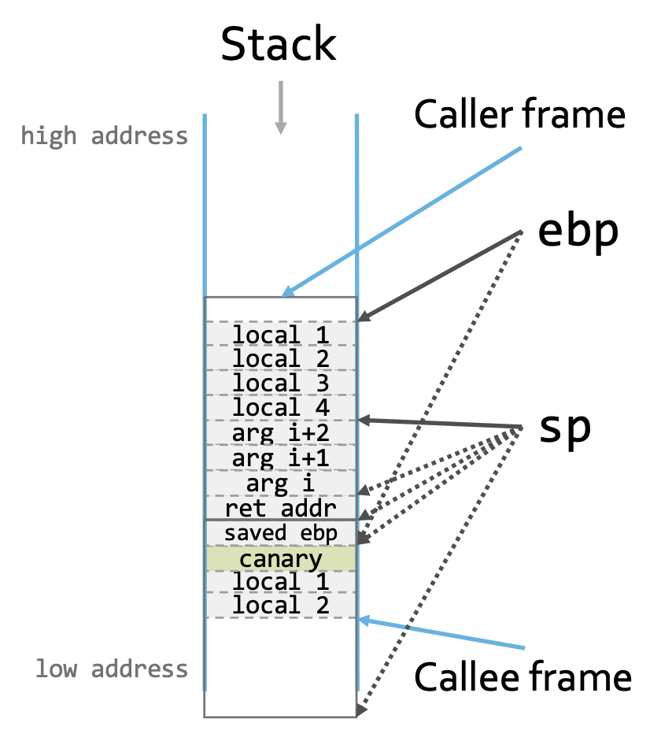</img>

### Bypass

- Questions:

  - _Is it possible to overwrite the canary with a valid canary value?_
  - _Is it possible to overwrite critical data without overwriting the canary?_

- Question 1:

  - Terminator canary can still be inserted with functions like `memcpy`
  - Random canary can still be guessed using brute force

    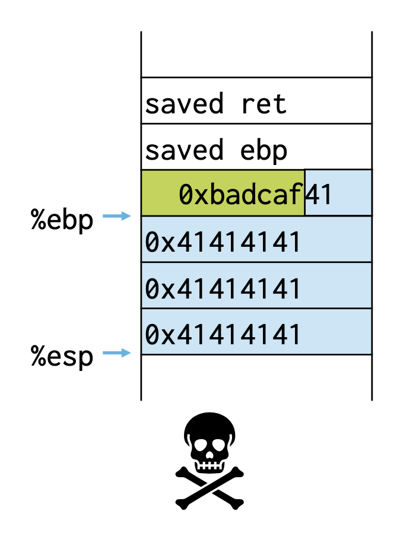</img>
    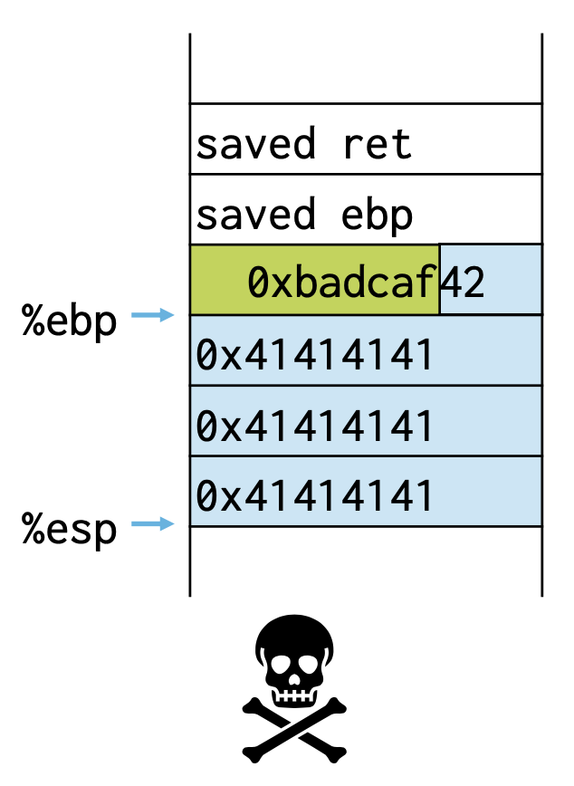</img>
    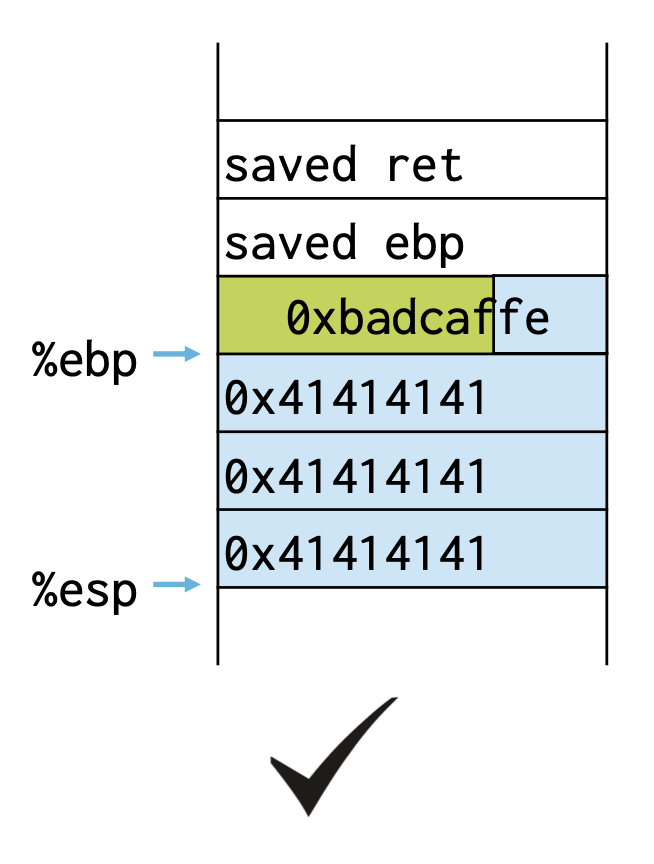</img>
    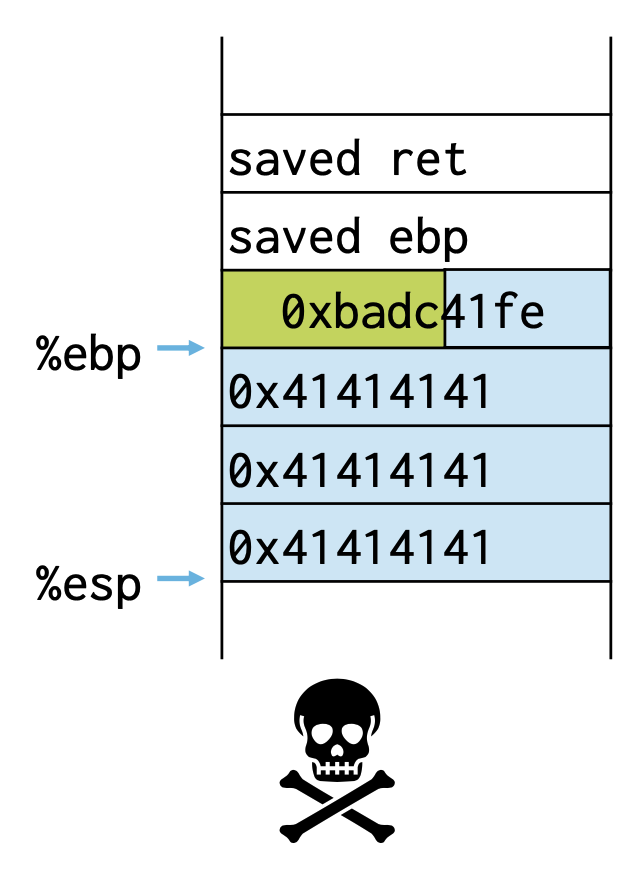</img>
    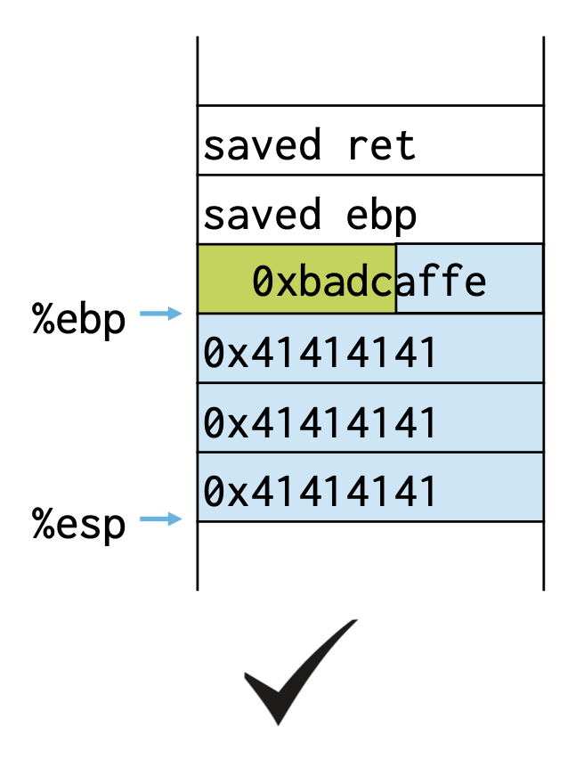</img>
    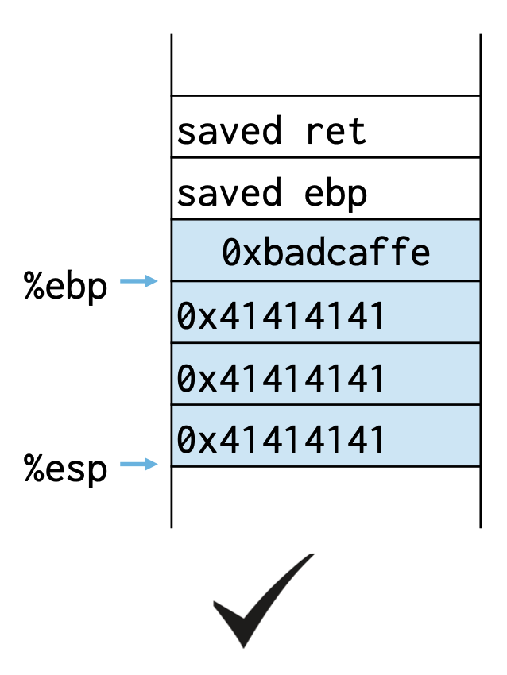</img>

- Question 2:

  - We can overwrite data not protected by canary
  - Local Variables
    - store result of a security check
    - one used in a security check
    - data pointers (pointer subterfuge)
    - function pointers

### Pointer subterfuge

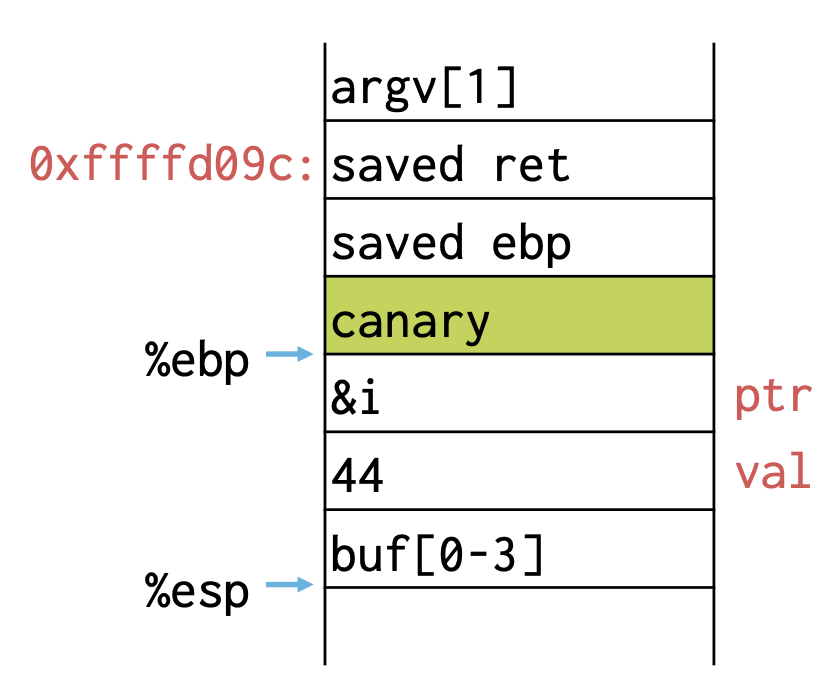</img>
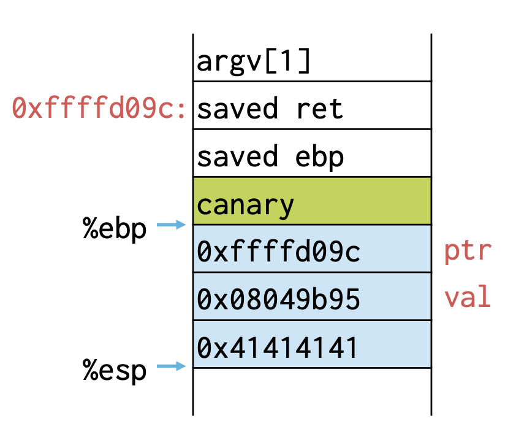</img>
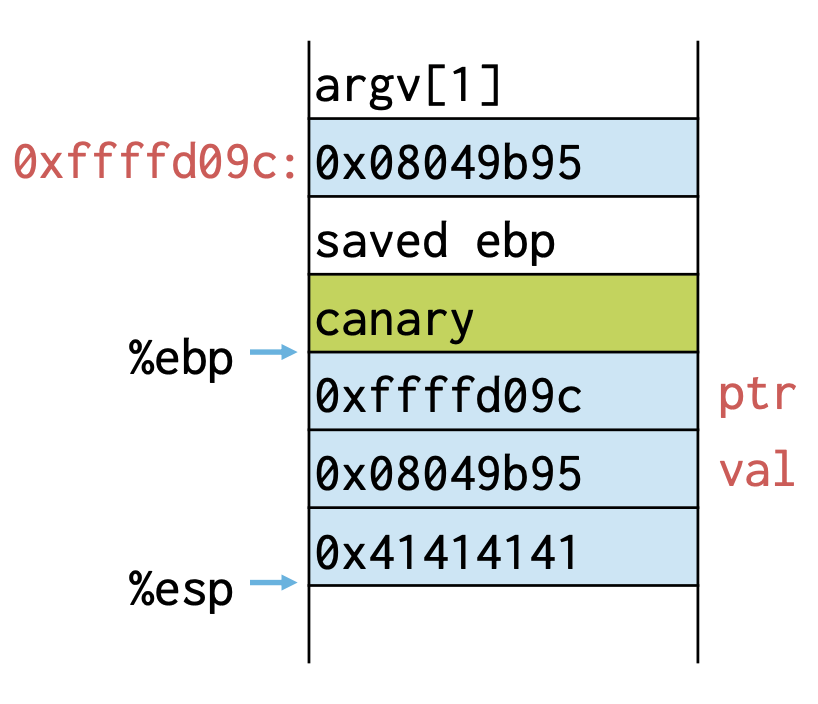</img>

### Potential Solutions

- How to protect local variable? reorder local variables and put buffer at the end of the frame

  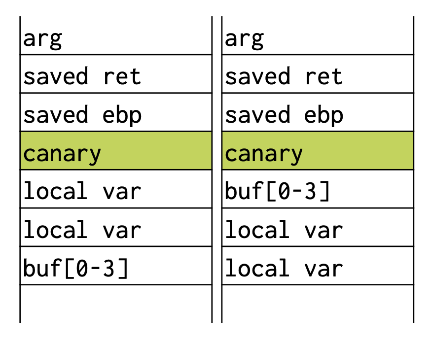</img>

- What about function arguments? Also copy them to the top of the stack

  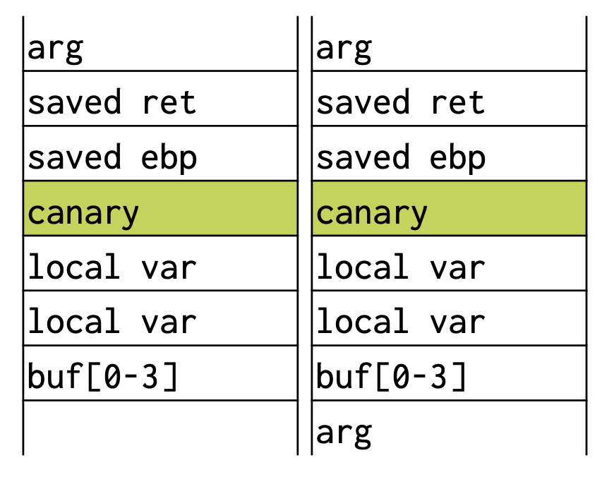</img>

### Limitations

- Stack canaries do not protect from non-sequential overwrites
  - pointer subterfuge
  - printf vulnerabilities
- Do not prevent but only detect the overwrite

## Non Executable Stack

- Idea: prevent execution of shellcode on stack
- Modern processors can mark virtual memory pages with permission bits to detect such violation

### Data Execution Prevention (DEP)

- Idea: mitigation extends beyond the stack
- Mark all pages either writable or executable
  - Also known as **W^X** (**Write XOR eXecute**)
- Tradeoffs:
  - Pros: No changes to application software, no/little performance overhead
  - Cons: Requires hardware support, does not work automatically with dynamic programming tricks
- Limitations: We don't prevent hacker from **executing existing code**

### Bypass

- Questions

  - _What if some pages need to be both writable and executable?_
  - _What if there is existing executable code you can repurpose?_
  - _What if an attacker can execute arbitrary code without the ability to inject it into the victim process?_

## Randomize Stack Base

- Idea: Add a random offset to stack base to make it harder to guess the stack address an attacker needs
- Bypass

  - brute force: guess
  - information leak
  - long NOP sled (target 6)
  - put the shellcode on heap

  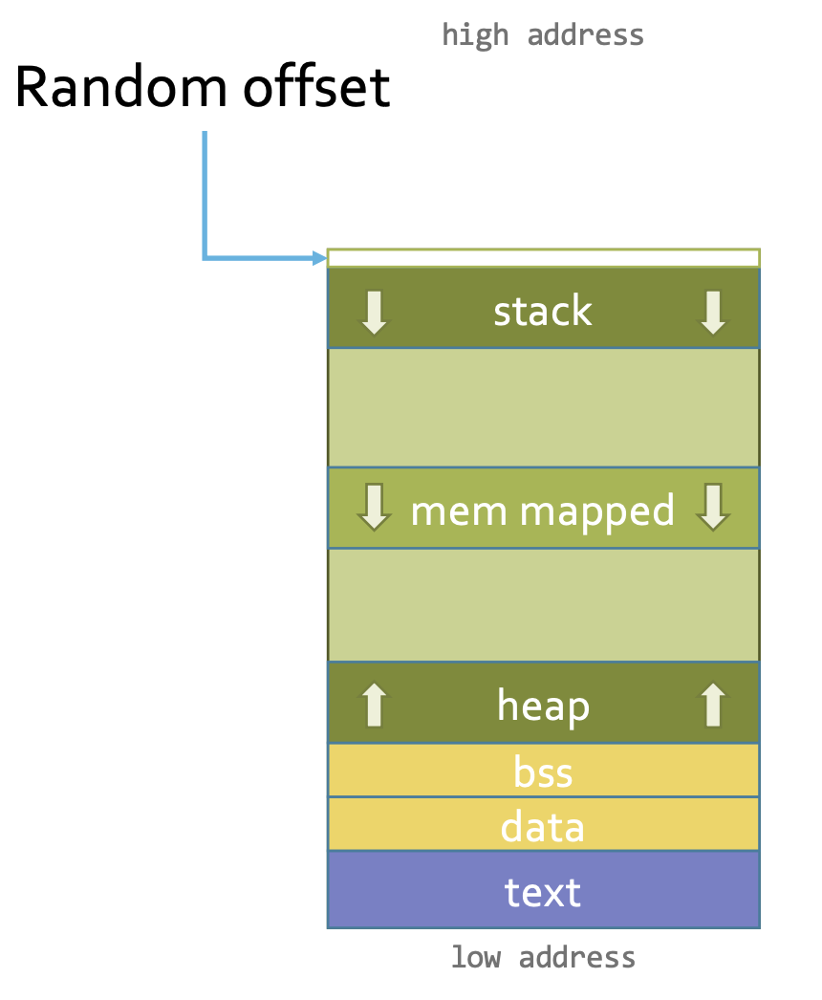</img>

### Address Space Layout Randomization (ASLR)

- Idea: mitigation extends beyong the address space
- Add offsets to all aother sections of the address space (stack, heap, mmap, ...)
- Tradeoffs:

  - Requires support of compiler, linker, and loader
  - Increases code size
  - Performance overhead

- Bypass

  - Heap Spraying

  </img>

### Heap Spraying

- Idea: overwhelm the heap with a bunch of copies of the shellcode
- Trigger jump to anywhere to hit the shellcode

## Keyword

- Terminator Canary: `0x000A0DFF` is null, CR, LF, and EOF, respectively. Hard to insert for string functions
