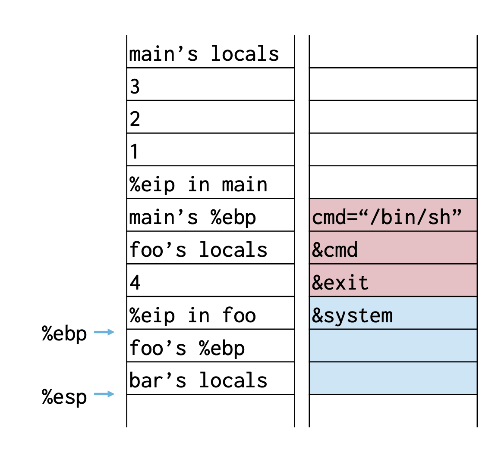
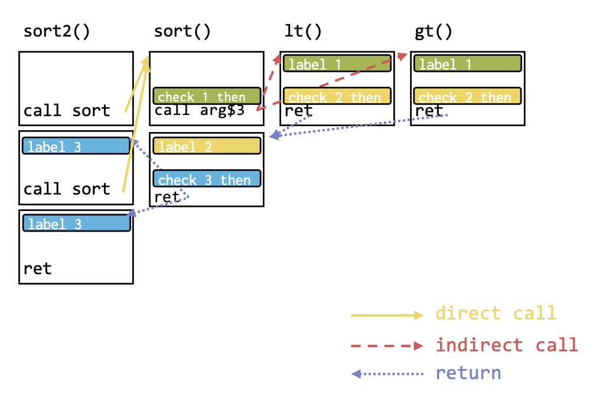
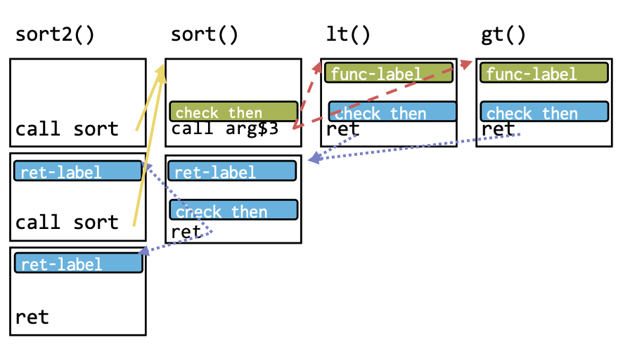

# Lecture 6

## Code Reuse Attack (Return-to-Libc)

- We can reuse the code in libc (e.g. system()) and rewrite the saved eip address to the target libc function
- We just need to set up the stack for the arguments and rewrite the saved eip
- For example

  </img>

## Return Oriented Programming

- Idea:
  - jump to almost the end of the function
  - execute the last few instructions
  - jump to another almost end of the function
- We can then **chain** these last instructions to create complex computation because `ret` $\rightarrow$ `popl %eip`
- These sets of code sequences ending in ret instruction are called **gadgets**
- **Stack pointer is the new instruction pointer** in this setting

## Control Flow Integrity

- Idea: ensure that `rets`, `calls`, etc... could only go to **known good targets**
- Basic Design:
  - Restrict all control transfers to the control flow graph
  - Assign labels to all indirect jumps and their targets
  - Before taking an indirect jump, validate that target label matches jump site
- Tradeoffs:
  - pros:
  - cons: performance & code size overheads and hardware support

### Direct vs. Indirect Control Flow

- Direct Control Flow
  - advancing to next instruction
  - jumping to hard-coded instruction
- Indirect Control Flow
  - jumping to an address in register or memory
  - **Forward path**: indirect calls and branches
  - **Reverse path**: return addresses on the stack

### Example

```c
void sort2 (int a[],int b[], int len) {
	sort(a, len, lt);
	sort(b, len, gt);
}

bool lt(int x, int y) {
	return x < y;
}

bool gt(int x, int y) {
	return x > y;
}
```

#### Fine Grained CFI

- Statically compute CFG
- Dynamically ensure program never deviates
- Can do a bit better with a **shadow stack**

</img>

#### Coarse Grained CFI

- Speed for precision
- Only two labels, no shadow stack
  - One for forward path
  - One for reverse path

</img>

## Keywords

1. Control Flow Graph (CFG): the graph above that shows the control flow between frames
2. Shadow Stack: the place where metadata is stored at function entry and compared at function exit (for CFI check)
